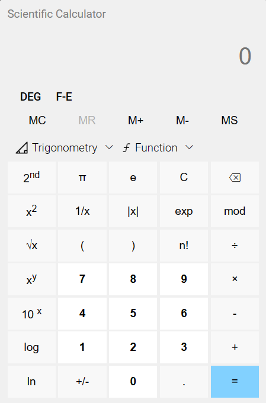

# Scientific Calculator

This is a scientific calculator that can perform various calculations based on user input. It was built using HTML, CSS, and JavaScript.

deploy Link: https://honey0908.github.io/Calculator-JS-Practical/



## Features

- Basic arithmetic operations: Addition, subtraction, multiplication, and division.
- Square root, cube root exponentiation
- Memory functions: The ability to store and recall values from memory.
- Trigonometric functions: Sine, cosine, tangent, and inverse Trigonometry functions
- Logarithmic functions: Natural logarithm, common logarithm, and exponential.
- Angle modes: The ability to switch between degrees, radians.
- Shows Errors for invalid inputs.

## Usage

To use the calculator, simply open the index.html file in a web browser. You should see the calculator interface with buttons for each of the supported operations.

To perform a calculation, click on the buttons for the numbers and operations you want to use, and then click on the = button to see the result.

## Folder Structure

```sh
│   index.html
│   index.js
│   README.md
│
├───assets
│       Calculator.png
│       favicon.png
│       function.png
│       trigonometry.png
│
└───css
        universal.css
```
